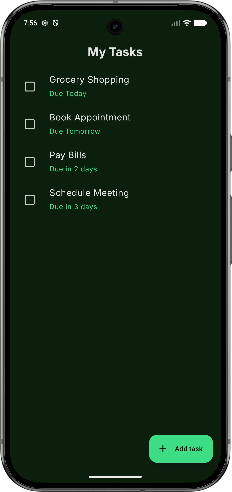
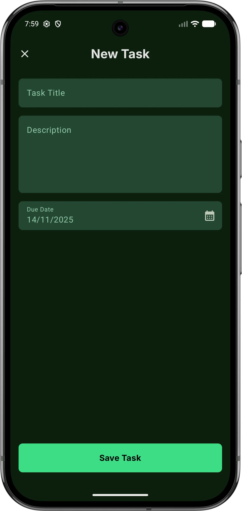
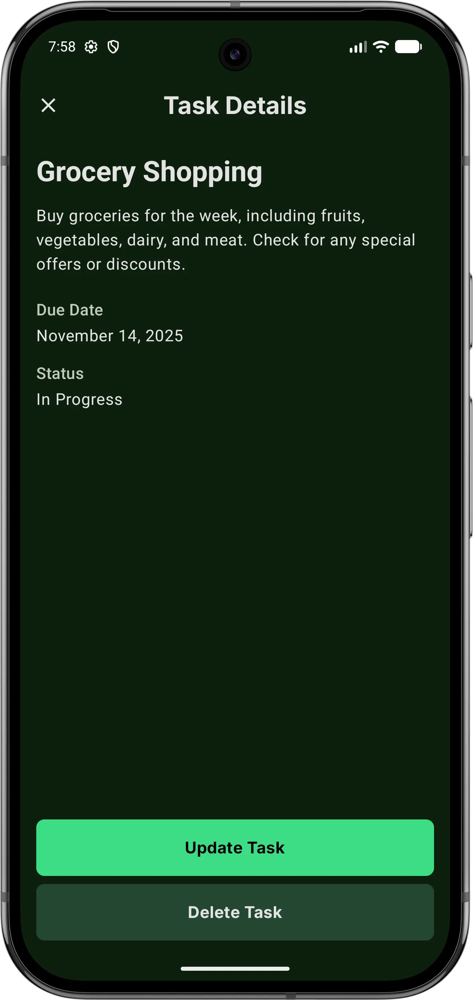
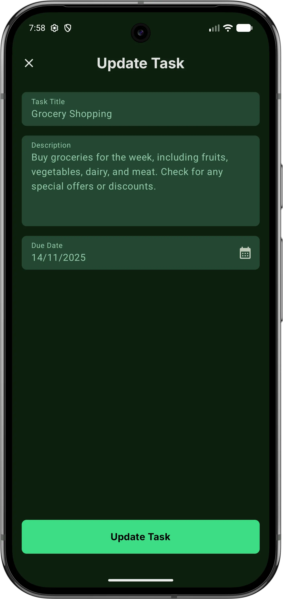

id: my-tasks-github-actions-codelab
summary: "In this codelab, you’ll complete a GitHub Actions workflow for the My-Tasks Android app."
authors: Ali Mansour
updated: 2025-11-24
status: Published
categories: android, ci-cd, github-actions
tags: android, github-actions, ci-cd, compose
environments: web
source: https://github.com/dev-ali-mansour/My-Tasks
feedback link: https://github.com/dev-ali-mansour/My-Tasks/issues
analytics account: ""
home: https://dev-ali-mansour.github.io/My-Tasks/

# Ship it Faster 🚀 Android CI/CD with GitHub Actions

## Introduction

Duration: 4:00

### About this codelab

**Last Updated:** November 24, 2025

**Author:** Ali Mansour

**Source:** [GitHub Repository](https://github.com/dev-ali-mansour/My-Tasks)

**Feedback:** [Submit Issues](https://github.com/dev-ali-mansour/My-Tasks/issues)

---

Continuous Integration (CI) is a fundamental practice in modern software development. For an Android app like "My-Tasks," a CI workflow can automatically build and test your code every time you open a pull request, ensuring that new changes don't break existing functionality.

This codelab will guide you through completing a "skeleton" GitHub Actions workflow file. You will implement the `TODO` items to build a complete, functioning CI pipeline.

The application we are working on named `My Tasks`

<p>
  
  <br/>
  
  <br/>
</p>

### 📌 What you'll build

* A complete GitHub Actions workflow (`.github/workflows/pull_request.yml`).
* A pipeline that automatically:
    1.  Validates the branch name for a pull request.
    2.  Runs all unit tests for the `My-Tasks` app.
* Job dependencies (validate → build → test).


### 🎯 What You’ll Learn

- How to trigger a workflow on `pull_request` to a specific branch.
- How to set the `runs-on` property to select a job runner.
- How to create job dependencies using `needs`.
- How to use standard actions like `actions/checkout` and `actions/setup-java`.
- How to grant permissions and run Gradle commands in a workflow.


### 🧰 What you'll need

* Basic Android + Git knowledge.
* A GitHub account.
* Your `My-Tasks` repository: `https://github.com/dev-ali-mansour/My-Tasks`.
* The `starter` branch checked out.
* Android Studio for to complete tasks.


---

## Getting Set Up

Duration: 7:00

Before we begin, let's get your environment ready.

### 1. Clone the repository
You have two options here:

#### A) Fork the repository (for contributors)

If you want to contribute to the repository or set up your own version with CI/CD:

1. Click the **Fork** button at the top right of this repository
2. Clone your forked repository:

```bash
git clone https://github.com/YOUR_USERNAME/My-Tasks.git
cd My-Tasks
```

**Setting up GitHub Secrets**

To enable the automated workflows (Pull Request checks and Google Play deployment), you need to configure the following secrets in your repository settings:

1. Go to your forked repository on GitHub
2. Navigate to **Settings** → **Secrets and variables** → **Actions**
3. Click **New repository secret** and add each of the following:

**Required Secrets for Release Workflow:**


| Secret Name             | Description                        | How to Get It                                    |
|-------------------------|------------------------------------|--------------------------------------------------|
| `KEYSTORE_PASSWORD`     | Password for your Android keystore | The password you set when creating your keystore |
| `KEY_ALIAS`             | Alias name for your signing key    | The alias you used when creating your key        |
| `KEY_PASSWORD`          | Password for your signing key      | The password you set for your signing key        |
| `ANDROID_KEYSTORE`      | Base64-encoded keystore file       | Run: `base64 -w 0 your-keystore.jks`             |
| `GOOGLE_PLAY_AUTH_JSON` | Google Play service account JSON   | Download from Google Play Console → API access   |

**Creating an Android Keystore (if you don't have one):**

```bash
keytool -genkey -v -keystore release-key.jks -keyalg RSA -keysize 2048 -validity 10000 -alias your-key-alias
```

**Encoding the Keystore for GitHub Secrets:**

```bash
base64 -w 0 release-key.jks > keystore-base64.txt
# Copy the content of keystore-base64.txt and paste it as ANDROID_KEYSTORE secret
```

**Setting up Google Play Service Account:**

1. Follow this [tutorial](https://medium.com/automating-react-native-app-release-to-google-play/create-google-play-service-account-68471d4b398b) to create a Google Play service account
2. Download the JSON key file
3. Copy the entire JSON content and paste it as `GOOGLE_PLAY_AUTH_JSON` secret

> **Note:** The release workflow will only trigger when you push a tag (e.g., `v1.0.0`). The pull request workflow runs automatically on PRs to `main` or `develop` branches.

#### B) Clone the repository (Simple setup)

If you just want to practice this codelab without contributing to the repository:

```bash
git clone https://github.com/dev-ali-mansour/My-Tasks.git
cd My-Tasks
```

### 3. Configure Java

On Linux, if you have JDK 21 installed at `/usr/lib/jvm/java-21-openjdk`:
```bash
export JAVA_HOME=/usr/lib/jvm/java-21-openjdk
export PATH="$JAVA_HOME/bin:$PATH"
java -version
```

You should see a Java 21 version.

On macOS, If you installed JDK 21 using Homebrew:
```bash
export JAVA_HOME=$(/usr/libexec/java_home -v 21)
export PATH="$JAVA_HOME/bin:$PATH"
java -version
```

If using Azul Zulu or Oracle JDK:
```bash
export JAVA_HOME=/Library/Java/JavaVirtualMachines/zulu-21.jdk/Contents/Home
```

or

```bash
export JAVA_HOME=/Library/Java/JavaVirtualMachines/zulu-21.jdk/Contents/Home
```

On macOS, If JDK 21 is installed (e.g., Oracle, Azul, Temurin) To set JAVA_HOME temporarily (PowerShell session only):
```poweshell
$env:JAVA_HOME="C:\Program Files\Java\jdk-21"
$env:Path="$env:JAVA_HOME\bin;$env:Path"
java -version
```

To set JAVA_HOME permanently:
```poweshell
setx JAVA_HOME "C:\Program Files\Java\jdk-21" /M
```
> **Note:** ⚠️ Restart PowerShell or your IDE after doing this.

### 4. Open in Android Studio

1. `File` → `Open...`
2. Select the `My-Tasks` folder.
3. Let Gradle sync and KSP/Room code generation complete.

### 5. Build and run

From Android Studio:

- Select a device or emulator.
- Click **Run** on the `app` configuration.

From the command line:

```bash
./gradlew :app:assembleDebug
```

The resulting APK will be in `app/build/outputs/apk/debug/`.


### 6. Running Tests

Unit tests (JVM):

```bash
./gradlew :app:testDebugUnitTest
./gradlew :app:testReleaseUnitTest
```


This runs unit tests for core use cases, repository implementations, and feature ViewModels like:

- `HomeViewModelTest`
- `NewTaskViewModelTest`
- `UpdateTaskViewModelTest`
- `TaskDetailsViewModelTest`

### 7. Test coverage (JaCoCo) - Optional

To generate a global JaCoCo coverage report:

```bash
./gradlew jacocoTestReport
```

Open the HTML report:

- `app/build/reports/jacoco/jacocoTestReport/html/index.html`

For per-package and per-class coverage, see the HTML tree under:

- `app/build/reports/jacoco/html/...`

---

## Explore Workflow

Duration: 5:00

1.  Make sure you are on the `starter` branch.
2.  In your repository, navigate to the workflow file: `.github/workflows/pull_request.yml`.

You will see the following content, which includes 7 `TODO` comments. We will now complete them one by one.

```yaml
name: Run tests
run-name: Run test - ${{ github.head_ref }}

# TODO: [1] Configure the trigger of this action to only run on pull requests to main or develop

jobs:
  validate_pr_sources:
    # TODO: [2] Configure the runner of this job to the latest Ubuntu version
    steps:
      - name: Validate source branch
        id: source_check
        run: |
          echo "Source branch is: ${{ github.head_ref }}"
          # Only enforce naming rules when PR targets the main branch
          if [[ "${{ github.base_ref }}" == "main" ]]; then
            echo "Validating source branch for PR to main..."
            # Allow only branches matching release/<major>.<minor>.<patch> or hotfix/<major>.<minor>.<patch>
            if [[ "${{ github.head_ref }}" =~ ^(release|hotfix)/[0-9]+\.[0-9]+\.[0-9]+$ ]]; then
              echo "✅ Pull request source is a valid release/hotfix branch."
            else
              echo "::error::❌ PRs to main are only allowed from release/x.y.z or hotfix/x.y.z branches (e.g., release/1.2.3 or hotfix/1.2.3). Got: ${{ github.head_ref }}"
              exit 1
            fi
          else
            echo "Skipping source branch validation because target branch is not main."
          fi


  run-tests:
    # TODO: [3] Configure this job to run after the source branch is validated
    runs-on: ubuntu-latest

    steps:
      # TODO: [4] Checkout the source branch

      # TODO: [5] Setup JAVA 21 and install Gradle

      - name: Cache Gradle files
        uses: actions/cache@v4
        with:
          path: |
            ~/.gradle/caches
            ~/.gradle/wrapper
          key: ${{ runner.os }}-gradle-${{ hashFiles('gradle/wrapper/gradle-wrapper.properties', '**/gradle.lockfile') }}
          restore-keys: |
            ${{ runner.os }}-gradle-

      # TODO: [6] Grant execution permission for the Gradle wrapper file

      # TODO: [7] Run the unit tests
```

---

## Configure the Workflow Trigger

Duration: 3:00

Our first step is to tell GitHub *when* this workflow should run. We want it to trigger **only** when a pull request is opened (or updated) against our `main` branch or `develop` branch.

### ✅ Set the workflow trigger

Find `TODO [1]` and replace it with the `on:` block.

**Replace this:**

```yaml
# TODO: [1] Configure the trigger of this action to only run on pull requests to main or develop
```

**With this:**

```yaml
on:
  pull_request:
    branches:
      - main
      - develop
```

This YAML structure tells GitHub to listen for the `pull_request` event, but only for pull requests targeting the `main` branch or `develop` branch.

---

## Configure the Validation Job

Duration: 2:00

Next, we'll configure the `validate_pr_sources` job. This job has two `TODO`s.

### ✅ Set the Job Runner

A "runner" is the virtual machine that will execute your job. We need to specify one. Let's use the latest available Ubuntu runner.

**Replace this:**

```yaml
  validate_pr_sources:
    # TODO: [2] Configure the runner of this job to the latest Ubuntu version
```

**With this:**

```yaml
  validate_pr_sources:
    runs-on: ubuntu-latest
```

---

## Configure the Test Job

Duration: 10:00

This is the main job where we'll check out our code and run our unit tests. This section has five `TODO`s.

### ✅ Create a Job Dependency

We don't want to run our tests *unless* the branch name is valid. To enforce this, we'll make the `run-tests` job dependent on `validate_pr_sources`. This is done using the `needs:` keyword.

**Replace this:**

```yaml
  run-tests:
    # TODO: [3] Configure this job to run after the source branch is validated
```

**With this:**

```yaml
  run-tests:
    needs: validate_pr_sources
```

This creates a dependency graph. The `run-tests` job will now wait for `validate_pr_sources` to complete successfully before it starts. If `validate_pr_sources` fails, `run-tests` will be skipped.

### ✅ Checkout the Source Code

The runner is a blank machine. It doesn't have your code on it yet. We must use the official `actions/checkout` action to pull a copy of our repository onto the runner.

**Replace this:**

```yaml
    steps:
      # TODO: [4] Checkout the source branch
```

**With this:**

```yaml
    steps:
      - name: Checkout
        uses: actions/checkout@v4
```

### ✅ Setup Java (JDK)

Our Android app requires Java to build. We'll use the `actions/setup-java` action to install Java 21 (Temurin distribution), which is a common requirement for modern Android builds.

**Replace this:**

```yaml
      # TODO: [5] Setup JAVA 21 and install Gradle
```

**With this:**

```yaml
      - name: Setup Java 21
        uses: actions/setup-java@v4
        with:
          distribution: 'temurin'
          java-version: '21'
```
> **Note:** The existing "Cache Gradle files" step will automatically handle the Gradle installation and caching, so we only need to set up Java.

### ✅ Grant Execution Permission

The Gradle Wrapper (`gradlew`) script in our repository needs to have "execute" permissions to run. By default, files checked out from Git might not have this permission.

**Replace this:**

```yaml
      # TODO: [6] Grant execution permission for the Gradle wrapper file
```

**With this:**

```yaml
      - name: Grant execute permission for gradlew
        run: chmod +x ./gradlew
```

### ✅ Run Unit Tests

Finally, it's time to run the tests! We'll use the `gradlew` script we just made executable to run the standard `test` task. This will execute all unit tests in the project.

**Replace this:**

```yaml
      # TODO: [7] Run the unit tests
```

**With this:**

```yaml
      - name: Run unit tests
        run: ./gradlew test
```

---

## Congratulations!

Duration: 5:00

You've successfully built a complete GitHub Actions CI workflow for your `My-Tasks` Android app!

Your final `pull_request.yml` file should look like this:

```yaml
name: Run tests
run-name: Run test - ${{ github.head_ref }}

on:
  pull_request:
    branches:
      - main
      - develop

jobs:
  validate_pr_sources:
    runs-on: ubuntu-latest
    steps:
      - name: Validate source branch
        id: source_check
        run: |
          echo "Source branch is: ${{ github.head_ref }}"
          # Only enforce naming rules when PR targets the main branch
          if [[ "${{ github.base_ref }}" == "main" ]]; then
            echo "Validating source branch for PR to main..."
            # Allow only branches matching release/<major>.<minor>.<patch> or hotfix/<major>.<minor>.<patch>
            if [[ "${{ github.head_ref }}" =~ ^(release|hotfix)/[0-9]+\.[0-9]+\.[0-9]+$ ]]; then
              echo "✅ Pull request source is a valid release/hotfix branch."
            else
              echo "::error::❌ PRs to main are only allowed from release/x.y.z or hotfix/x.y.z branches (e.g., release/1.2.3 or hotfix/1.2.3). Got: ${{ github.head_ref }}"
              exit 1
            fi
          else
            echo "Skipping source branch validation because target branch is not main."
          fi

  run-tests:
    needs: validate_pr_sources
    runs-on: ubuntu-latest

    steps:
      - uses: actions/checkout@v4
        with:
          fetch-depth: 0

      - name: Setup JDK 21
        uses: actions/setup-java@v4
        with:
          distribution: 'temurin'
          java-version: 21

      - name: Cache Gradle files
        uses: actions/cache@v4
        with:
          path: |
            ~/.gradle/caches
            ~/.gradle/wrapper
          key: ${{ runner.os }}-gradle-${{ hashFiles('gradle/wrapper/gradle-wrapper.properties', '**/gradle.lockfile') }}
          restore-keys: |
            ${{ runner.os }}-gradle-

      - name: Grant execution permission for gradlew
        run: chmod +x gradlew

      - name: Run Unit Tests
        run: ./gradlew test

```

### Verify Your Work

1.  Commit your changes to the `pull_request.yml` file on the `starter` branch (or a new feature branch, e.g., `feature/ci-workflow`).
2.  Open a new pull request from your branch to `main`.
3.  Go to the **Actions** tab in your repository. You should see your "Run tests" workflow running.
4.  Click on the workflow to see the jobs. `validate_pr_sources` will run first, followed by `run-tests`.


### What's Next?

* Explore the `release.yml` workflow file in the project. It has been built to trigger on pushing tag starts with `v`, then it starts running test, bumping the version, generating signed bundle, and upload it to Google Play.
* Add a step to generate test reports using Java Code Covering plugin(Jacoco).
* Add a step to upload test reports as artifacts.
* Add a step to validate test coverage threshold.
* Create another job to run Android instrumented tests (`androidTest`) on an emulator.


### Resources:

- [Android Docs](https://developer.android.com/develop)
- [GitHub Actions Docs](https://docs.github.com/en/actions)
- [Test-driven development for Android](https://www.youtube.com/playlist?list=PLdqCqcIH93jv0B2gXT-X7LdnFXOs2vEVF)
